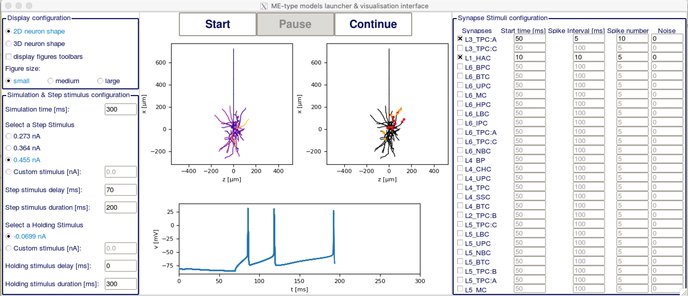

############
EModelRunner
############

+----------------+------------+
| Latest Release | |pypi|     |
+----------------+------------+
| Documentation  | |docs|     |
+----------------+------------+
| License        | |license|  |
+----------------+------------+
| Build Status 	 | |build|    |
+----------------+------------+
| Coverage       | |coverage| |
+----------------+------------+
| Support        | |gitter|   |
+----------------+------------+

Introduction
============

EModelRunner is a python library designed to run the cell models provided by the Blue Brain portals in a simple and straightforward way.

It consists of two main modules:

- one module designed to show the synapse plasticity phenomenon. It has the following features:

  - ability to run post-synaptic cell with pre-recorded output of pre-synaptic cell
  - ability to run 'full' pair simulations, where both the pre-synaptic and the post-synaptic cells are run at the same time
  - analysis tool to compute the change of EPSPs

- one module designed to run the cells from the SomatoSensoryCortex portal, with the following features:

  - ability to use Steps and Ramps protocols
  - synapse stimulation
  - ability to produce hoc files to run the cells
  - a GUI

Note that EModelRunner is a convenience tool and does not aim to be a universal simulator.

Support
=======

We are providing support using a chat channel on `Gitter <https://gitter.im/BlueBrain/EModelRunner>`_.

Installing EModelRunner
=======================

The usual way to install EModelRunner is using pip. In that case, you probably want to use a python virtual environment.

Install using ``pip``::

    pip install emodelrunner

Installing from source 
----------------------

If you want to make changes to emodelrunner, you might want to install it using the 
source repository. The same remarks of the section above apply, 
the only difference is that you clone the git repo::

   git clone https://github.com/BlueBrain/EModelRunner.git

and run pip from inside the newly created emodelrunner subdirectory 
(don't forget the dot at the end of the command)::

    pip install -e .

Supported systems
-----------------

The code of emodelrunner can be installed on any POSIX system that supports 
pip-installable python code.

Dependencies
============

The main dependencies of EModelRunner are::

    Python3.7+ 
    Matplotlib
    Numpy
    Neurom
    H5py
    NEURON
    BluePyOpt
    Schema

Ideally, follow the installation instructions of these tools, or use 
pre-installed versions.

Python
------

Modern Linux systems will have Python 2.7 or 3 installed. Make sure that your python version is 3.7 or higher.

Make sure you're using a recent version of pip. It's best to run ::

    pip install pip --upgrade

before installing anything else using pip.

Examples
========

Synapse Plasticity example
--------------------------

You can find an example cell package in example/synplas_sample_dir.
Go to this folder, or to a cell package that has been designed to work with the synapse plasticity functions.

Run the simulation
~~~~~~~~~~~~~~~~~~

Running the simulation should be as easy as::

    sh run.sh config_path

Where ``config_path`` is the path to a specific config file. You will find the available config files in the config folder.
It will run the post-synaptic cell using pre-defined spike train of the pre-synaptic cell to stimulate the synapses.

You can also do a full pair simulation, where both the pre-synaptic and the post-synaptic cells are simulated. 
This should be as easy as::

    sh run_pairsim.sh config_path

Where ``config_path`` is the path to a specific config file. You will find the available config files in the config folder.

Once the simulation is done, the output is stored as ``output_{protocol_details}.h5``.
If the precell has been simulated too, its output is stored as ``output_precell_{protocol_details}.h5``.

Please, bear in mind that, since it is difficult to make the pre-synaptic cell spike at exactly the same time as in the pre-recorded spike-train file
(especially when the pre-synaptic cell has to spike multiple times in a row),
the results of the 'full pair' simulation might differ slightly from those of the 'post-synaptic cell only' simulation.

All the config files are working for both the 'post-synaptic cell only' and the 'full pair' simulations.

Analyse the output
~~~~~~~~~~~~~~~~~~

Start by loading the class useful for the analysis with the following command::

    from emodelrunner.synplas_analysis import Experiment

Then create an Experiment instance::

    exp = Experiment(data="output_50Hz_10ms.h5", c01duration=, c02duration=, period=)

With data being the path to your output file, or a dictionary containing the output data, 
``c01duration``, respectively ``c02duration``, are the duration of the EPSP monitoring before, respectively after, the induction protocol,
period is the period at which the synapses are stimulated.

Note that the period argument can be replaced by ``c01period`` and ``c02period`` if the period used for the stimulation of the synapses is different after and before the induction protocol.

The change of EPSPs can then be computed by using the compute_epsp_ratio method, as follows::

    EPSP_ratio = exp.compute_epsp_ratio(n=60, method="amplitude)

With ``n`` the number of sweeps to be considered for mean EPSP calculation, 
and method the method to use to compute EPSP ratio (can be "amplitude" or "slope").

Sscx example
------------

You can find an example cell package in ``example/sscx_sample_dir``.
Go to this folder, or to a cell package that has been designed to work with the sscx functions.

Run the simulation using python
~~~~~~~~~~~~~~~~~~~~~~~~~~~~~~~

Running the simulation should be as easy as::

    sh run.sh config_path

Where ``config_path`` is the path to a specific config file. You will find the available config files in the config folder.
Note that the protocol used will depend on the contents of the config file.

The output can be found under ``python_recordings``.

Run the simulation using hoc
~~~~~~~~~~~~~~~~~~~~~~~~~~~~

You can also run the simulation using hoc. In order to do that, you will have to first create the hoc files with the following line::

    python create_hoc.py --config_path config_path

Where ``config_path`` is the path to a specific config file. You will find the available config files in the config folder.
Note that not all the protocols in the config files can be turned into hoc yet.

Then run the simulation with::

    sh run_hoc.sh

The output can be found under python_recordings.

GUI
~~~

|GUI_screenshot|

There is also a GUI available for the sscx cells. To launch it, you have to go in a sscx-compatible cell package, and then type::

    python -m emodelrunner.GUI

The usage of the GUI is pretty much self-explanatory.

In the upper part of the left column, you have the display configuration. You may want to change the figure size depending on your screen size for optimal display.
In the lower part of the left column is the step and holding stimuli configuration. You can put both to custom stimulus and set them to 0 if you don't want to have any step stimulus.

In the right column you have the synapse stimuli configuration. Check the box of each synapse mtype you want to receive stimuli from.
The activated synapses will display on the right figure with red dots for excitatory synapses and yellow dots for inhibitory synapses.
You can then set on the right column at which time each synapse group should start firing, at which interval and how many times they should fire, and if they should have any noise.

In the center part of the GUI, you have two plots of the cell, the one on the left showing the voltage at each section, and the one on the right showing the synapses locations.
You can change the rotation of both plots in 3D with your mouse.
Below is a plot showing the voltage in the soma depending on time. On top, you have three buttons to (re)start the simulation, pause it or resume it.

Funding & Acknowledgements
==========================

The development of this project was supported by funding to the Blue Brain Project, a research center of the École polytechnique fédérale de Lausanne (EPFL), from the Swiss government’s ETH Board of the Swiss Federal Institutes of Technology.

Copyright (c) 2020-2021 Blue Brain Project/EPFL

.. |build| image:: https://github.com/BlueBrain/EModelRunner/actions/workflows/test.yml/badge.svg
                :target: https://github.com/BlueBrain/EModelRunner/actions/workflows/test.yml
                :alt: Build Status

.. |license| image:: https://img.shields.io/badge/License-Apache_2.0-blue.svg
                :target: https://github.com/BlueBrain/EModelRunner/blob/main/LICENSE.txt
                :alt: Build Status

.. |docs| image:: https://readthedocs.org/projects/emodelrunner/badge/?version=latest
                :target: https://emodelrunner.readthedocs.io/en/latest/?badge=latest
                :alt: Documentation Status

.. |coverage| image:: https://codecov.io/gh/BlueBrain/EModelRunner/coverage.svg?branch=main
                :target: https://codecov.io/gh/BlueBrain/EModelRunner?branch=main
                :alt: Coverage

.. |pypi| image:: https://img.shields.io/pypi/v/emodelrunner.svg
                :target: https://pypi.org/project/EModelRunner/
                :alt: Latest Release

.. |gitter| image:: https://badges.gitter.im/BlueBrain/EmodelRunner.svg
   :alt: Join the chat at https://gitter.im/BlueBrain/EmodelRunner
   :target: https://gitter.im/BlueBrain/EmodelRunner?utm_source=badge&utm_medium=badge&utm_campaign=pr-badge&utm_content=badge
